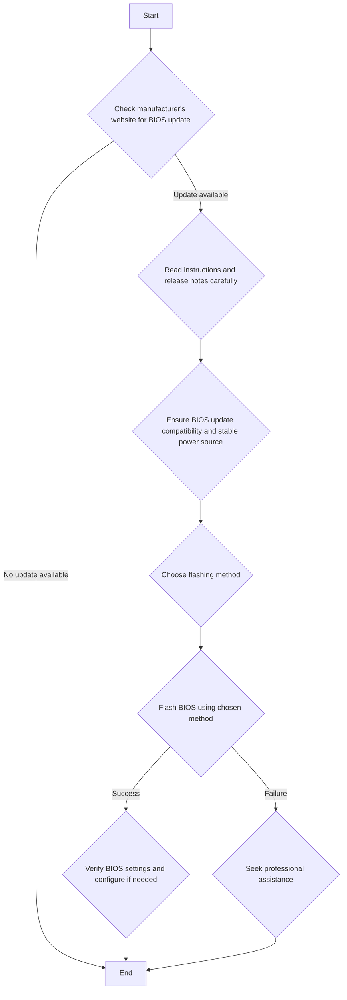

Flashing the BIOS refers to the process of updating the firmware of a computer's Basic Input/Output System (BIOS). The BIOS is a low-level software that is stored on a non-volatile memory chip on the computer's motherboard. It is responsible for initializing hardware components and loading the operating system when the computer is turned on.

1. Purpose: The primary reason for flashing the BIOS is to update it to a newer version that may include bug fixes, performance improvements, compatibility updates for new hardware, or additional features.

2. Obtaining the update: BIOS updates are released by the computer or motherboard manufacturer. They can be downloaded from the manufacturer's website.

3. Preparation: Before flashing the BIOS, read the manufacturer's instructions and release notes. Ensure that the BIOS update is compatible with your specific computer model and that you have a reliable power source to prevent interruptions during the process.

4. Flashing methods: There are different methods to flash the BIOS, depending on the manufacturer and model:
   - Through the BIOS setup utility: Some BIOS versions have a built-in option to update the firmware from within the BIOS setup screen.
   - Using a bootable USB drive: The BIOS update file is copied to a bootable USB drive, and the computer is configured to boot from the USB drive to initiate the update process.
   - Through Windows or Linux: Some manufacturers provide BIOS flashing utilities that can be run from within the operating system.

5. Risks: Flashing the BIOS is a sensitive process, and if interrupted or performed incorrectly, it can potentially render the computer unbootable. Follow the instructions carefully and ensure a stable power supply throughout the process.

6. Precautions: Before flashing the BIOS, back up data and create a system restore point (if using Windows) as a precautionary measure. Connect the computer directly to a power outlet rather than relying on battery power.

7. Post-flashing: After successfully flashing the BIOS, enter the BIOS setup utility and verify that the settings are configured correctly. In some cases, the BIOS update may reset the settings to their default values.

Flashing the BIOS is not a routine task and should only be done when necessary, such as when experiencing specific issues that can be resolved by a BIOS update or when enabling support for new hardware. If you are unsure about the process or the need for a BIOS update, consult with a professional technician or the manufacturer's support team for guidance.

This mermaid diagram represents the flowchart for the process of flashing the BIOS:

1. Start the process
2. Check the manufacturer's website for a BIOS update
   - If an update is available, proceed to step 3
   - If no update is available, end the process
3. Read the instructions and release notes carefully
4. Ensure BIOS update compatibility and stable power source
5. Choose the flashing method
6. Flash BIOS using the chosen method
   - If successful, proceed to step 7
   - If it fails, seek professional assistance and end the process
7. Verify BIOS settings and configure if needed
8. End the process

The diagram uses diamond shapes for decision points and rectangular shapes for actions. The arrows indicate the flow of the process based on the outcomes of the decision points.

Flashing the BIOS refers to the process of updating or rewriting the BIOS firmware of a computer's motherboard. The BIOS (Basic Input/Output System) is a critical piece of software that initializes and manages the hardware components of a computer before the operating system takes over. Here’s a detailed explanation of what flashing the BIOS involves, why it's done, and how to do it safely.

### What is Flashing the BIOS?

Flashing the BIOS is the process of updating the firmware stored on the BIOS chip on the motherboard. This firmware is essential for starting up the computer and for various hardware interactions. The update is typically performed by replacing the old BIOS version with a new version provided by the motherboard manufacturer.

### Why Flash the BIOS?

1. **Bug Fixes**: Manufacturers release BIOS updates to fix known bugs and issues that may cause system instability or hardware malfunctions.
2. **Hardware Compatibility**: Newer hardware components, such as CPUs, RAM, and GPUs, may require BIOS updates to be recognized and function properly.
3. **Performance Improvements**: Updates can include performance enhancements and optimizations for the system.
4. **Security Patches**: BIOS updates can include security patches to protect against vulnerabilities.

### Risks of Flashing the BIOS

- **Bricking the Motherboard**: If the flashing process is interrupted or fails, it can corrupt the BIOS, rendering the motherboard unusable.
- **Power Failure**: A power loss during the update can corrupt the BIOS.
- **Incorrect Version**: Installing an incorrect BIOS version can cause system instability or failure.

### How to Flash the BIOS

1. **Identify Current BIOS Version**:
   - Enter the BIOS setup during startup by pressing a key such as `F2`, `DEL`, or `ESC`.
   - Note the current BIOS version displayed in the BIOS setup utility.

2. **Download the BIOS Update**:
   - Visit the motherboard manufacturer’s website.
   - Navigate to the support or downloads section for your specific motherboard model.
   - Download the latest BIOS update file and the flashing utility, if needed.

3. **Prepare for Flashing**:
   - **Create a Bootable USB Drive**: Sometimes, the update requires a bootable USB drive with the update files.
   - **Backup Important Data**: Although rare, there is a risk of data loss, so it's prudent to back up important files.

4. **Flash the BIOS**:
   - **Method 1: From within BIOS**: Some motherboards allow you to update the BIOS directly from the BIOS setup utility using a USB drive with the BIOS file.
   - **Method 2: Using a Flash Utility**: The manufacturer may provide a utility that runs within the operating system or from a DOS bootable USB drive.
   - **Method 3: Using BIOS Update Software**: Manufacturers often provide BIOS update software that can be run from the operating system (e.g., ASUS EZ Flash, Gigabyte @BIOS).

5. **Follow Manufacturer Instructions**:
   - Each manufacturer may have specific steps for flashing the BIOS. Carefully read and follow the instructions provided with the BIOS update file.

6. **Reboot the System**:
   - After the flashing process is complete, reboot the system. You may need to reconfigure BIOS settings.

### Example Procedure (ASUS EZ Flash Utility)

1. **Download the BIOS update** from the ASUS support website.
2. **Format a USB drive** to FAT32 and copy the BIOS file to it.
3. **Restart your computer** and enter the BIOS setup (`DEL` or `F2`).
4. Navigate to the **EZ Flash Utility** in the BIOS menu.
5. Select the **BIOS file from the USB drive**.
6. Confirm the update and **start the flashing process**.
7. **Wait for the process to complete** and reboot the system.

### References

- [ASUS BIOS Update Utility](https://www.asus.com/support/FAQ/1008859)
- [Gigabyte BIOS Update Guide](https://www.gigabyte.com/Support/FAQ/300)
- [MSI BIOS Update Guide](https://www.msi.com/page/bios-update)

By following these steps and ensuring that the process is not interrupted, you can safely update your BIOS to benefit from new features, improved compatibility, and security enhancements.
