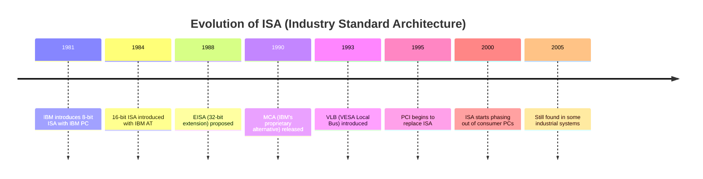
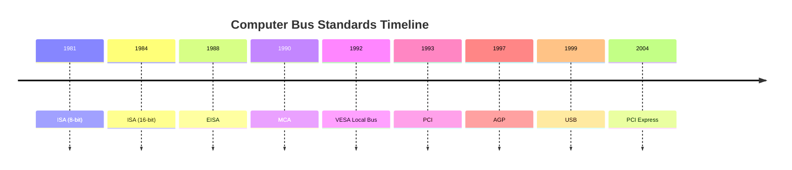

The ISA (Industry Standard Architecture) bus is a type of computer bus used for adding expansion cards to the motherboard. Introduced in the early 1980s, it was standard in IBM-compatible PCs. The ISA bus allows various peripheral devices, such as network cards, sound cards, and modems, to communicate with the CPU and memory. It operates at a clock speed of 8 MHz and supports both 8-bit and 16-bit data transfers. Despite being largely obsolete today, it was critical in the development of early personal computers.

The ISA (Industry Standard Architecture) bus is an older computer bus standard used for connecting peripheral devices to the motherboard. Here are key points about the ISA bus:

1. Origin:
   - Introduced by IBM in 1981 with the IBM PC
   - Became an industry standard, hence the name

2. Characteristics:
   - Originally 8-bit, later expanded to 16-bit
   - Operated at relatively low speeds (8 MHz for 16-bit version)
   - Parallel bus architecture

3. Uses:
   - Connected devices like sound cards, network cards, modems, and other expansion cards

4. Advantages in its time:
   - Simplicity
   - Wide compatibility across different PC manufacturers

5. Limitations:
   - Slow compared to modern standards
   - Limited bandwidth
   - Lack of Plug and Play capabilities in early versions

6. Evolution:
   - 8-bit version in original IBM PC
   - 16-bit version introduced with IBM AT in 1984
   - EISA (Extended ISA) was a 32-bit extension, but not widely adopted

7. Decline:
   - Largely replaced by PCI (Peripheral Component Interconnect) in the mid-1990s
   - Further superseded by AGP, PCI Express, and other modern interfaces

8. Legacy:
   - Found in some industrial and embedded systems until the early 2000s
   - Virtually non-existent in modern consumer PCs

9. Historical Importance:
   - Played a crucial role in the standardization of PC architecture
   - Allowed for a wide ecosystem of third-party hardware manufacturers

While ISA is no longer used in modern computers, understanding it is valuable for historical context in computer architecture and for maintaining legacy systems.

