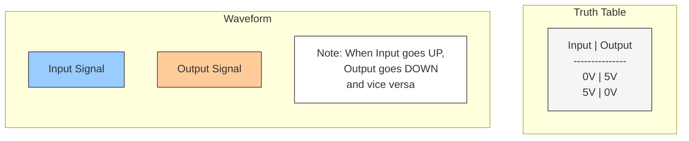

29.md
30.md

Run this next:

voltage-stabilizer.md

Complete steps for:

21, 22.md

How is the current controlled in current controller? See 16.md. How does varying the resistor value affect the amount of current flowing through the circuit. This concept should be a different experiment. This should only focus on the concept: Changing the resistor values does not have any effect of the current value before or after the resistor.

Experiments

bypass-capacitor.md
voltage-doubler.md
transistor-oscillator.md
transistor-current.md

Design a simple experiment using Tinkercad for light sensor
Does Tinkercad have temperature sensor

Compare side by side:

23.md

Review electronics/design/oscilloscope.md. Condense the notes.
Review function-generator.md. Condense the notes.

Positive Clamper - Watch videos. Break down into smaller experiments.

Time constant of capacitor:

https://www.youtube.com/watch?v=T0_Z0jw2DhI
https://www.youtube.com/watch?v=pb0yduMthWE

Review 18.md, 8b.md

Capacitor AC Pass (not working ?)

Review

- Review discrete-passive-circuit.md
- Review passive-component.md and extract or delete experiments
- Review and condense load.md
- Review Zettels and extract basic level content for different chapters
- Review instructables for hackerboxes and take notes about using breadboard. Create diagrams to illustrate the connections.

Search

- Run ack -w 'experiment' and revise

Questions

Extract

- Extract summarized content from components folder and add to each experiment explanation. Add history of the term also.

Edits

- Add the system concept.
		- What is a system
		- What are the elements in a system
		- How does this circuit map to a system?

Circuit Diagram

- Draw circuit diagram by hand for each experiment
- Create a polished version of polarized capacitor experiment and scan the circuit
- need circuit diagram for inductor, led circuit, short circuit
- Convert hand drawn diagrams to CircuitTiz diagrams

Diagrams

- Create diagrams for mats.md

Experiments

- Refer simulation, run real experiments, take photos

Whiteboard

- Webcam to monitor every room
- Motion detector
- Plant watering
- Measure humidity inside the house (auto adjust thermostat)
- Portable high speed Internet

Misc

- Work backwards from experiments
		- Order existing experiments from simple to complex.
		- Summarize the experiment. What is it about? What is the learning objective?
		- Explain each component used in the experiment.
		- Use the questions in template.md to cover the detailed explanation.
- 1 concept - 1 experiment. Then n concepts - 1 experiment. Finally a mini-project at the end of a section.

- Refer electronics encyclopedia book and note down categorization
- Figure 1-1 Encyclopedia of Electronics

- Render the svg using the html and take screenshots

Scope

- No discussuion of any laws (only basic high level principles)
- No IC
- No coding
- No waste by causing damage to electronic components
- Discrete components
- 90% practical, 10% theory
- No discussion of topics not in Tinkercad basic section
- Basics of physics in the context of electronics
- Basics of TRIZ in the context of electronics

Author

- Design experiments
- Sequence of experiments
- Insights from basic principles
- Using innovation in the context of electronics

An inverter is called that way because it "inverts" or reverses the input signal:

- When input is HIGH (5V), output is LOW (0V)
- When input is LOW (0V), output is HIGH (5V)

Let me show this with a truth table and waveform diagram:

Design a simplest inversion circuit that can be run using Tinkercad

In your LED circuit:
1. When you connect the input (R2) to 5V:
   - Input is HIGH
   - LED turns OFF (output is LOW)

2. When you connect input to ground (or leave it floating):
   - Input is LOW
   - LED turns ON (output is HIGH)

This inverting behavior is fundamental to digital logic, and this circuit is also known as a NOT gate because it performs the logical NOT operation: whatever the input is, the output is the opposite.
