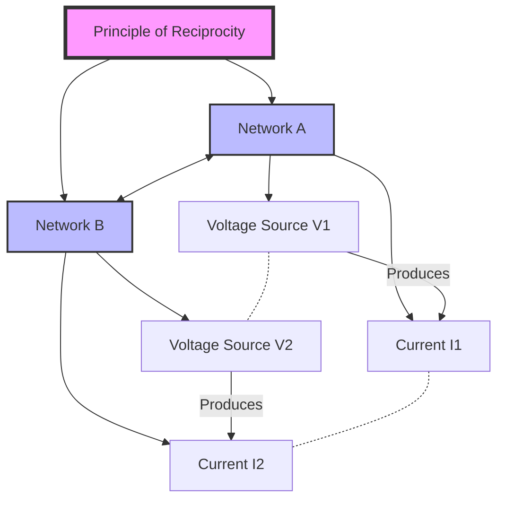

PENDING

Move to out of scope folder

Here's a Mermaid diagram illustrating the Principle of Reciprocity in electronics:

This diagram represents:

1. The Principle of Reciprocity connecting two networks (A and B).
2. In Network A, voltage source V1 produces current I1.
3. In Network B, voltage source V2 produces current I2.
4. The dotted lines between V1-V2 and I1-I2 indicate their interchangeability.
5. The two-way arrow between networks shows their reciprocal relationship.

The principle states that if a voltage source in one branch of a network causes a current in another branch, then the same voltage source, if applied to the second branch, will cause an identical current in the first branch.

TAG

Reciprocity
