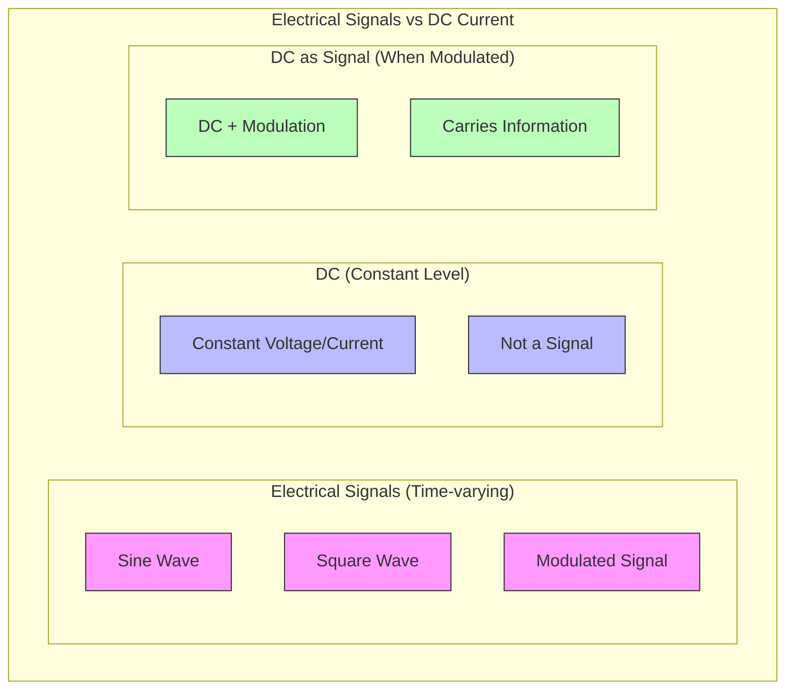
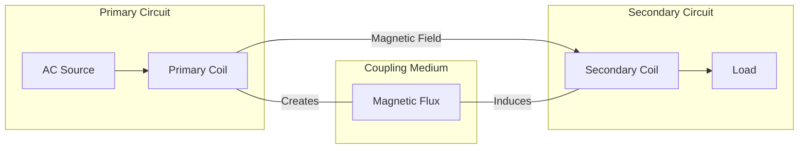

An active electronic component is a device that can control or amplify electrical signals. It requires an external power source to operate. They can introduce energy into the circuit and manage the flow of current. Common examples are transistors and diodes. They are used in circuits to provide switching, amplification and regulation of electrical signals. They can modify electrical power within a circuit. Active component is like a pump in a water system that adds energy and controls the flow of water.

Passive components are like pipes that direct the flow of current.

A transistor is an active component. It requires an external power source to amplify electrical signals. It acts as a switch or amplifier in a circuit.

A transistor is a three terminal device. It has a base, collector and an emitter. It can switch or amplify signals. Apply a small current to the base, the transistor will allow a larger current to flow between the collector and the emitter. This controls the current in the circuit.

A diode allows current to flow in one direction. It blocks current in the opposite direction. This propery is used to convert alternating current (AC) to direct current (DC) in rectifier circuits. A diode is like a one-way valve in a plumbing system, where a water can only flow in one direction. In a power supply circuit, a diode is used to convert AC from a wall outles into DC that powers electronic devices such as a phone charger.

<svg xmlns="http://www.w3.org/2000/svg" viewBox="0 0 800 600">
    <!-- 1. Active vs Passive Components Analogy -->
    <rect x="50" y="30" width="700" height="150" fill="#f5f5f5" stroke="gray"/>
    <text x="60" y="50" font-size="14" font-weight="bold">Active vs Passive Components Analogy</text>
    
    <!-- Water pump (Active) -->
    <circle cx="150" cy="100" r="25" fill="none" stroke="blue" stroke-width="2"/>
    <path d="M 125 100 L 175 100 M 150 75 L 150 125" stroke="blue" stroke-width="2"/>
    <text x="130" y="140" font-size="12">Pump (Active)</text>
    
    <!-- Pipe (Passive) -->
    <path d="M 250 90 L 350 90 L 350 110 L 250 110 Z" fill="none" stroke="gray" stroke-width="2"/>
    <text x="280" y="140" font-size="12">Pipe (Passive)</text>
    
    <!-- Flow arrows -->
    <path d="M 200 100 L 240 100" stroke="blue" stroke-width="2" marker-end="url(#arrowhead)"/>
    <path d="M 360 100 L 400 100" stroke="blue" stroke-width="2" marker-end="url(#arrowhead)"/>
    
    <!-- 2. Transistor Structure -->
    <rect x="50" y="200" width="700" height="180" fill="#f5f5f5" stroke="gray"/>
    <text x="60" y="220" font-size="14" font-weight="bold">Transistor Structure and Operation</text>
    
    <!-- Transistor symbol -->
    <circle cx="150" cy="280" r="30" fill="none" stroke="black" stroke-width="2"/>
    <path d="M 150 250 L 150 310" stroke="black" stroke-width="2"/>
    <path d="M 135 265 L 165 295" stroke="black" stroke-width="2"/>
    <path d="M 135 295 L 165 265" stroke="black" stroke-width="2"/>
    
    <!-- Labels -->
    <text x="170" y="260" font-size="12">Collector</text>
    <text x="170" y="280" font-size="12">Base</text>
    <text x="170" y="300" font-size="12">Emitter</text>
    
    <!-- Current flow illustration -->
    <path d="M 250 260 L 350 260" stroke="red" stroke-width="2" marker-end="url(#arrowhead)"/>
    <text x="270" y="250" font-size="10">Large Current</text>
    <path d="M 250 300 L 350 300" stroke="blue" stroke-width="1" marker-end="url(#arrowhead)"/>
    <text x="270" y="320" font-size="10">Small Control Current</text>
    
    <!-- 3. Diode Operation -->
    <rect x="50" y="400" width="700" height="180" fill="#f5f5f5" stroke="gray"/>
    <text x="60" y="420" font-size="14" font-weight="bold">Diode Operation and Water Valve Analogy</text>
    
    <!-- Diode symbol -->
    <path d="M 150 480 L 200 480" stroke="black" stroke-width="2"/>
    <path d="M 200 460 L 200 500 L 240 480 Z" fill="none" stroke="black" stroke-width="2"/>
    <path d="M 240 480 L 290 480" stroke="black" stroke-width="2"/>
    
    <!-- Water valve analogy -->
    <circle cx="400" cy="480" r="20" fill="none" stroke="blue" stroke-width="2"/>
    <path d="M 380 480 L 420 480" stroke="blue" stroke-width="2"/>
    <path d="M 400 460 L 400 500" stroke="blue" stroke-width="2"/>
    
    <!-- AC to DC conversion -->
    <path d="M 500 480 C 520 460, 540 460, 560 480 C 580 500, 600 500, 620 480" 
          stroke="red" fill="none" stroke-width="1"/>
    <path d="M 650 480 L 700 480" stroke="red" fill="none" stroke-width="1"/>
    <text x="500" y="520" font-size="10">AC to DC Conversion</text>
    
    <!-- Arrowheads definition -->
    <defs>
        <marker id="arrowhead" markerWidth="10" markerHeight="7" 
                refX="9" refY="3.5" orient="auto">
            <polygon points="0 0, 10 3.5, 0 7" fill="black"/>
        </marker>
    </defs>
</svg>

PENDING DIAGRAMS

What is an electrical signal?

An electrical signal is a time-varying voltage or current that carries information, typically represented as variations in electrical properties (amplitude, frequency, or phase) through a conductor or transmission medium.

No, DC (Direct Current) alone is not an electrical signal since it maintains a constant voltage/current level and doesn't vary with time. However, when DC is modulated or varied, it becomes a signal that can carry information.

<svg viewBox="0 0 400 300" xmlns="http://www.w3.org/2000/svg">
    <!-- Grid -->
    <defs>
        <pattern id="grid" width="40" height="40" patternUnits="userSpaceOnUse">
            <path d="M 40 0 L 0 0 0 40" fill="none" stroke="#ddd" stroke-width="0.5"/>
        </pattern>
    </defs>
    <rect width="400" height="300" fill="url(#grid)" />

    <!-- Time axis -->
    <line x1="0" y1="150" x2="400" y2="150" stroke="black" stroke-width="1"/>
    <text x="380" y="170">Time</text>

    <!-- DC Signal -->
    <line x1="0" y1="50" x2="400" y2="50" stroke="blue" stroke-width="2"/>
    <text x="10" y="40">DC Level</text>

    <!-- Sine Wave Signal -->
    <path d="M 0 150 C 25 50, 75 50, 100 150 C 125 250, 175 250, 200 150 C 225 50, 275 50, 300 150 C 325 250, 375 250, 400 150" 
          fill="none" stroke="red" stroke-width="2"/>
    <text x="10" y="200">Signal (Sine Wave)</text>

    <!-- Modulated DC -->
    <path d="M 0 250 C 25 220, 75 220, 100 250 C 125 280, 175 280, 200 250 C 225 220, 275 220, 300 250 C 325 280, 375 280, 400 250" 
          fill="none" stroke="green" stroke-width="2"/>
    <text x="10" y="290">Modulated DC</text>
</svg>

Is inductive coupling used in wireless chargers of the phones?

Yes, wireless phone chargers use inductive coupling. They create an alternating magnetic field in the charging pad's coil which induces a voltage in the receiving coil in the phone, enabling wireless power transfer.

Active electronic components are devices that can control or amplify electrical signals and require an external power source. Examples include transistors, diodes, and integrated circuits. These components are crucial for switching, amplifying, and regulating electrical signals in circuits.

Transistors are key active components that control large currents using a smaller input current. Diodes allow current to flow in one direction, making them useful for converting AC to DC. Integrated circuits combine multiple active elements to perform complex functions such as computation and signal processing.

In electronic circuits, active components like transistors and op-amps amplify signals, while diodes are used for directional control. These components, which require external power, are essential in both simple and complex electronic systems.

