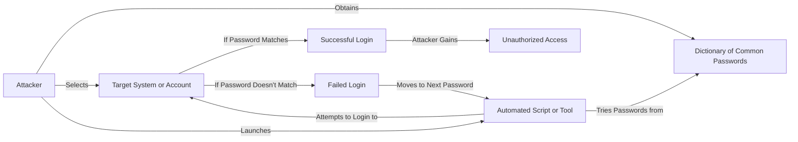

Here's a Mermaid diagram that illustrates a Dictionary Attack:

In this diagram:

1. The Attacker obtains a dictionary of common passwords. This dictionary can be a pre-compiled list of frequently used passwords or a customized list based on the attacker's knowledge of the target.

2. The Attacker selects a target system or user account to attack. This could be a specific website, application, or individual user account.

3. The Attacker launches an automated script or tool to carry out the Dictionary Attack. This tool is designed to automate the process of trying different passwords from the dictionary.

4. The automated script or tool takes the passwords from the dictionary and attempts to log in to the target system or account using each password.

5. If a password from the dictionary matches the  password of the target account, the login attempt is successful, and the Attacker gains unauthorized access to the system or account.

6. If a password from the dictionary doesn't match the  password, the login attempt fails. The automated script or tool then moves on to the next password from the dictionary and tries again.

7. The process continues until either a successful login occurs or all the passwords from the dictionary have been exhausted.

Dictionary Attacks exploit the fact that many users tend to use weak, common, or easily guessable passwords. By using a pre-compiled list of common passwords, attackers can significantly increase their chances of guessing the correct password and gaining unauthorized access.

To mitigate the risk of Dictionary Attacks, it's important to:

- Encourage users to use strong, unique, and complex passwords that are not easily guessable.
- Implement password complexity requirements and enforce password policies that discourage the use of common or weak passwords.
- Employ rate limiting and account lockout mechanisms to prevent automated attempts and limit the number of failed login attempts.
- Implement additional security measures, such as two-factor authentication, to provide an extra layer of protection beyond passwords.
- Regularly educate users about the importance of using strong passwords and the risks associated with using common or easily guessable passwords.

By adopting these security measures, the impact of Dictionary Attacks can be significantly reduced, making it more difficult for attackers to gain unauthorized access to systems and user accounts.
