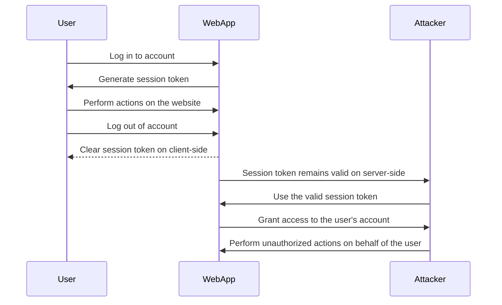

Here's a Mermaid diagram that illustrates how an attacker can gain access to the account of a logged-out user:

In this diagram:

1. The User logs in to their account on the WebApp.
2. The WebApp generates a session token for the User.
3. The User performs actions on the website while logged in.
4. The User logs out of their account.
5. The WebApp clears the session token on the client-side (e.g., deletes the session cookie).
6. However, due to improper session management, the session token remains valid on the server-side even after the user has logged out.
7. The Attacker obtains the valid session token (e.g., through sniffing, XSS, or other means).
8. The Attacker uses the valid session token to send requests to the WebApp.
9. The WebApp grants access to the user's account based on the valid session token.
10. The Attacker can now perform unauthorized actions on behalf of the logged-out user.

This diagram illustrates a potential vulnerability where the server-side session is not properly invalidated when a user logs out. If the session token remains valid on the server-side, an attacker who obtains the token can gain unauthorized access to the user's account, even after the user has logged out.

To mitigate this risk, it's important to implement proper session management,  server-side session invalidation upon logout and using secure session token generation and storage mechanisms.