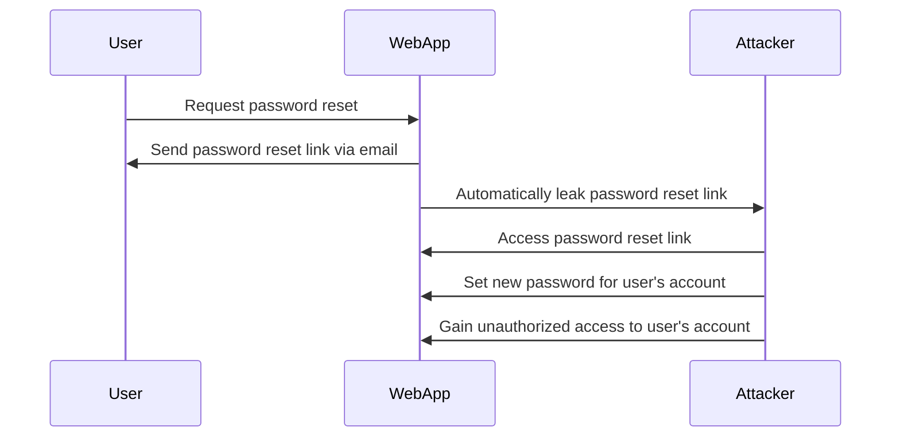

Here's a Mermaid diagram that illustrates the automatic leakage of a password reset link:

In this diagram:

1. The User requests a password reset from the WebApp.
2. The WebApp sends a password reset link to the User via email.
3. However, due to a vulnerability or misconfiguration, the WebApp automatically leaks the password reset link to the Attacker.
4. The Attacker accesses the leaked password reset link.
5. The Attacker uses the password reset link to set a new password for the User's account.
6. The Attacker gains unauthorized access to the User's account using the newly set password.

This diagram highlights the potential security risk of automatically leaking password reset links, which can allow attackers to compromise user accounts without the user's knowledge or consent.
