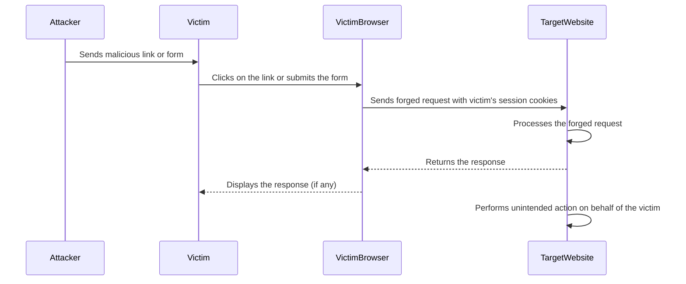
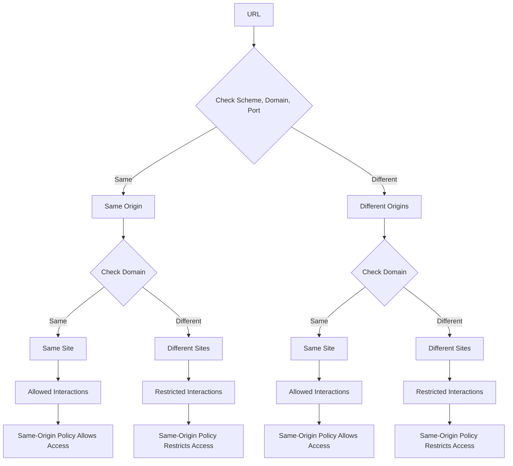

CSRF stands for Cross-Site Request Forgery. It is a type of web security vulnerability that allows an attacker to induce users to perform unintended actions on a web application in which they are currently authenticated.

1. Unauthorized Actions:
   - CSRF exploits the trust that a web application has in a user's browser.
   - It allows an attacker to trick a victim's browser into sending a forged request to the web application.
   - The forged request appears to be a legitimate request from the authenticated user.
   - The attacker can make the user perform unintended actions, such as changing account settings, making purchases, or submitting forms.

2. Exploiting User's Authentication:
   - CSRF attacks rely on the fact that the user is authenticated to the target web application.
   - When a user is authenticated, their browser typically sends authentication tokens (such as cookies) with each request to the application.
   - The attacker exploits this by crafting a malicious request that includes the user's authentication tokens.

3. Forged Requests:
   - The attacker creates a malicious link, webpage, or HTML form that triggers a forged request to the target web application.
   - The forged request is designed to perform an unintended action on behalf of the authenticated user.
   - The request appears to originate from the victim's browser, making it seem legitimate to the web application.

4. Tricking the User:
   - For a CSRF attack to be successful, the attacker has to trick the user into clicking a malicious link or visiting a malicious webpage.
   - This can be done through various methods, such as sending a phishing email, posting a malicious link on social media, or injecting malicious code into a trusted website.

5. Lack of Proper Validation:
   - CSRF vulnerabilities arise when a web application fails to properly validate the origin and authenticity of requests.
   - If the application relies solely on authentication tokens to validate requests, it becomes susceptible to CSRF attacks.

6. Prevention Techniques:
   - CSRF attacks can be prevented by implementing proper security measures, such as:
     - Anti-CSRF tokens: Including unique, unpredictable tokens in each request and validating them on the server-side.
     - Same-Site cookies: Setting the `SameSite` attribute on cookies to restrict their inclusion in cross-site requests.
     - Referer validation: Checking the `Referer` header to ensure requests originate from the expected source.
     - User interaction-based confirmation: Requiring user interaction (e.g., re-authentication) for sensitive actions.

7. Impact and Consequences:
   - CSRF attacks can lead to unauthorized actions, data modification, or disclosure of sensitive information.
   - They can compromise user accounts, perform financial transactions, or manipulate application settings without the user's knowledge.
   - CSRF vulnerabilities impacts the confidentiality, integrity, and availability of web applications and user data.

Developers should implement appropriate CSRF prevention mechanisms, and users should be cautious when clicking on links or interacting with untrusted websites. Regular security testing and keeping web applications updated with the latest security patches are also important to mitigate the risk of CSRF attacks.

## Why?

The term "Cross-Site" in "Cross-Site Request Forgery" refers to the fact that the forged request originated from a different website or domain than the target web application. It highlights the cross-site nature of the attack.

Here's why "Cross-Site" is used in the name:

1. Different Origin:
   - In a CSRF attack, the malicious request is typically initiated from a different website or domain than the target web application.
   - The attacker's website or a compromised website serves as the source of the forged request.
   - The request crosses the boundaries of the original site and targets a different site, hence the term "Cross-Site."

2. Violation of Same-Origin Policy:
   - Web browsers enforce a security policy called the Same-Origin Policy (SOP).
   - SOP restricts web pages from making requests to a different domain than the one that served the web page.
   - However, certain types of requests, such as GET requests or form submissions, are allowed to cross site boundaries.
   - CSRF attacks exploit this loophole by making the victim's browser send a forged request to a different site, violating the Same-Origin Policy.

3. Exploiting User's Authenticated Session:
   - CSRF attacks rely on authenticated user in the target web application.
   - The attacker's goal is to make the victim's browser send a request to the target site while the user is still logged in.
   - By leveraging the user's authenticated session, the forged request appears to be a legitimate cross-site request from the user.

4. Differentiating from Other Attacks:
   - The term "Cross-Site" helps differentiate CSRF from other types of attacks that target a single site.
   - For example, Cross-Site Scripting (XSS) is another web security vulnerability, but it involves injecting malicious scripts into a single website.
   - Using "Cross-Site" in CSRF emphasizes the distinct nature of the attack, where the request originates from a different site than the target application.

5. Highlighting the Trust Exploit:
   - CSRF attacks exploit the trust that a web application has in a user's browser and the user's authenticated session.
   - By including "Cross-Site" in the name, it emphasizes that the attack takes advantage of the trust relationship across different sites.
   - It underscores the need for web applications to validate and verify the authenticity of requests, even if they appear to come from authenticated users.

The "Cross-Site" aspect is a crucial characteristic of CSRF attacks, as it involves forging requests from a different website to the target application. It highlights the importance of implementing proper CSRF prevention mechanisms to ensure that requests originate from trusted sources and are genuinely initiated by the authenticated user.

## Same Origin Policy

What is the same origin policy?

The Same-Origin Policy (SOP) is a security mechanism implemented in web browsers to prevent malicious scripts on one web page from accessing data on another web page without permission. This policy restricts how a document or script loaded from one origin can interact with resources from another origin.

### Definition of Origin

An "origin" is defined by the combination of:

1. **Scheme (protocol)**: such as `http` or `https`.
2. **Host (domain)**: such as `www.example.com`.
3. **Port**: such as `80` for HTTP and `443` for HTTPS.

Two URLs have the same origin if and only if all three components (scheme, host, and port) match.

### Purpose of Same-Origin Policy

The main purpose of the Same-Origin Policy is to protect user data from being accessed or manipulated by malicious websites. It prevents certain types of harmful interactions between resources loaded from different origins.

### Examples of SOP in Action

1. **XMLHttpRequest**: A script on `https://example.com` cannot make an `XMLHttpRequest` to `https://another-example.com` unless `another-example.com` explicitly allows it via Cross-Origin Resource Sharing (CORS).
2. **DOM Access**: A script on `https://example.com` cannot access the Document Object Model (DOM) of a page loaded from `https://another-example.com`.
3. **Cookies**: Cookies set by `https://example.com` cannot be read by `https://another-example.com`.

### Relaxing the Same-Origin Policy

In some cases, it is necessary to allow controlled interactions between different origins. This can be achieved by:

1. **Cross-Origin Resource Sharing (CORS)**: Allows servers to specify who can access resources via HTTP headers. For example, a server can include the header `Access-Control-Allow-Origin: https://another-example.com` to permit cross-origin requests from that domain.
2. **JSONP (JSON with Padding)**: A technique used to bypass the SOP restrictions by using `<script>` tags to request resources from different origins, as script tags are not restricted by SOP.
3. **PostMessage API**: Allows safe communication between windows/frames across different origins by sending messages via `window.postMessage`.

### Importance and Challenges
The Same-Origin Policy is essential for maintaining the security and integrity of web applications. However, it can also present challenges for legitimate use cases where cross-origin resource sharing is required. Developers must configure their applications to balance security and functionality, often using CORS to manage these requirements.

### References
- [MDN Web Docs: Same-Origin Policy](https://developer.mozilla.org/en-US/docs/Web/Security/Same-origin_policy)
- [OWASP: Cross-Origin Resource Sharing (CORS)](https://owasp.org/www-community/attacks/CORS_OriginHeaderScrutiny)

In summary, the Same-Origin Policy is a foundational security feature in web browsers that restricts how scripts and documents from one origin can interact with resources from another origin, thereby protecting user data from unauthorized access and manipulation.

## Mermaid diagram for CSRF

Here's a Mermaid diagram that illustrates a typical Cross-Site Request Forgery (CSRF) attack flow:

CSRF attack flow:

1. The attacker crafts a malicious link or form designed to perform an unintended action on the target website.

2. The attacker sends the malicious link or form to the victim, typically through channels like email, social media, or a compromised website.

3. The victim, who is already authenticated on the target website, clicks on the malicious link or submits the malicious form.

4. The victim's browser sends a forged request to the target website, automatically including the victim's session cookies or authentication tokens.

5. The target website receives the forged request and processes it as if it were a legitimate request from the authenticated victim.

6. The target website performs the unintended action specified in the forged request, such as changing account settings, making a purchase, or deleting data.

7. The target website may return a response to the victim's browser, which can be displayed to the victim.

8. The target website has now performed an unintended action on behalf of the victim, without the victim's knowledge or consent.

This diagram illustrates how a CSRF attack exploits the trust relationship between the victim's browser and the target website. The attacker tricks the victim into initiating a forged request, making the target website perform unintended actions while assuming the request is legitimate.

To prevent CSRF attacks, developers can implement defense mechanisms, such as:

- Including anti-CSRF tokens in forms and requests
- Validating the origin of requests
- Using the `SameSite` attribute on cookies to restrict their inclusion in cross-site requests

## Conditions for CSRF Attack

What are the conditions that must be met for a CSRF attack to be possible?

For a Cross-Site Request Forgery (CSRF) attack to be possible, certain conditions must be met.

1. User Authentication:
   - The victim must be authenticated to the target web application.
   - CSRF attacks rely on the victim's active session or authentication credentials.
   - If the user is not authenticated, the attack will not have the intended impact.

2. Predictable Request Parameters:
   - The target web application must use predictable request parameters for performing sensitive actions.
   - If the request parameters are easily guessable or can be determined by the attacker, they can be included in the forged request.
   - Unpredictable or dynamically generated parameters, such as anti-CSRF tokens, can help mitigate CSRF attacks.

3. No Proper CSRF Defenses:
   - The target web application must lack proper CSRF defense mechanisms.
   - If the application does not implement adequate CSRF protection, such as anti-CSRF tokens or proper request validation, it becomes vulnerable to CSRF attacks.
   - Absence or improper implementation of CSRF defenses allows the attacker's forged requests to be processed by the application.

4. Browser's Cookie-Based Authentication:
   - The victim's browser must automatically include the relevant authentication cookies or tokens with each request to the target web application.
   - Browsers typically send cookies associated with a website for each request made to that site.
   - If the authentication mechanism relies solely on cookies without additional checks, the attacker can leverage the victim's authenticated session.

5. No User Interaction Required:
   - The target web application must allow sensitive actions to be performed without requiring additional user interaction or confirmation.
   - If the application requires user interaction, such as re-authentication or explicit confirmation for sensitive actions, CSRF attacks become more difficult to execute.
   - Applications that rely solely on the presence of authentication cookies for sensitive actions are more susceptible to CSRF.

6. Ability to Lure the Victim:
   - The attacker must have a means to lure the victim into clicking a malicious link or submitting a crafted form.
   - This typically involves tricking the victim through social engineering techniques, such as phishing emails or malicious websites.
   - If the attacker cannot convince the victim to interact with the malicious content, the CSRF attack may not be successful.

7. Same-Site Policy Loopholes:
   - The target web application must not properly utilize the `SameSite` attribute on cookies to restrict their inclusion in cross-site requests.
   - If the `SameSite` attribute is not set to `Strict` or `Lax`, the attacker's forged requests can include the victim's authentication cookies.
   - Proper configuration of the `SameSite` attribute can help prevent CSRF attacks.

When these conditions are met, an attacker can craft a malicious request, lure the victim into initiating it, and make the victim's browser send the forged request to the target web application, potentially leading to unauthorized actions or data manipulation.

To prevent CSRF vulnerabilities, web developers should implement CSRF defense mechanisms" such as:

- Anti-CSRF tokens
- Strict validation of request origins
- User interaction-based confirmations for sensitive actions
- Proper configuration of the `SameSite` attribute on cookies.
- Regularly updating and patching web applications
- Educating users about potential risks

For a Cross-Site Request Forgery (CSRF) attack to be possible, several conditions must be met. Understanding these conditions helps in recognizing potential vulnerabilities and implementing necessary defenses. Here are the key conditions:

### 1. **Authenticated Session**
The victim must have an active, authenticated session with the target website. This means the user is logged in, and their browser holds valid session cookies or tokens.

### 2. **Session Persistence**
The target website must rely on automatic mechanisms (like cookies or HTTP basic authentication) to authenticate requests without requiring re-authentication for every action. These mechanisms allow the browser to automatically include authentication credentials with each request.

### 3. **Predictable Action**
The action being targeted by the CSRF attack must be one that can be predictably initiated by the attacker. For example, the attacker must know or be able to guess the structure of the URL and the parameters needed to perform the action (e.g., a request to change the user's email address).

### 4. **Vulnerable Endpoint**

The target website must not be using sufficient CSRF protections on the vulnerable endpoint. This typically means the absence of anti-CSRF tokens (also known as CSRF tokens) or improper implementation of such tokens.

### 5. **User Interaction**

The victim must be induced to perform an action that triggers the malicious request. This is typically done through social engineering tactics, such as sending a link via email, embedding the request in an image tag, or using a form submission.

### Example Scenario

1. **User Authentication**: Alice is logged into her online banking account.
2. **Session Cookie**: Alice’s browser has a session cookie for the banking site.
3. **Predictable Request**: The attacker knows that a GET request to `https://bank.com/transfer?amount=1000&to=attacker_account` will transfer money from Alice's account to the attacker’s account.
4. **Lack of Anti-CSRF Token**: The banking site does not require an anti-CSRF token to validate the transfer request.
5. **User Interaction**: Alice visits a malicious website while logged into her bank account, and the website contains an embedded image tag: ``.

### References

1. [OWASP CSRF](https://owasp.org/www-community/attacks/csrf)
2. [MDN Web Docs: Cross-Site Request Forgery (CSRF)](https://developer.mozilla.org/en-US/docs/Glossary/CSRF)
3. [CSRF Attack Explained with Examples](https://www.acunetix.com/blog/web-security-zone/csrf-attacks/)

### Preventive Measures

To mitigate CSRF attacks, the following measures are commonly implemented:
- **Anti-CSRF Tokens**: Use unique tokens that must be included in every state-changing request.
- **SameSite Cookies**: Use the `SameSite` attribute to restrict how cookies are sent with cross-site requests.
- **Custom Headers**: Require custom headers that cannot be set by cross-site requests (e.g., `X-Requested-With`).
- **Referer/Origin Header Checks**: Validate the `Referer` or `Origin` headers of incoming requests to ensure they originate from the same origin.

The terms "site" and "origin" have specific definitions in web security contexts, relating to the Same-Origin Policy (SOP). They are about how web browsers enforce security boundaries.

### Origin

An **origin** is defined by three components:

1. **Scheme (protocol)**: e.g., `http`, `https`.
2. **Host (domain)**: e.g., `www.example.com`.
3. **Port**: e.g., `80`, `443`.

An origin is unique if all three of these components match.

**Example of origins**:
- `https://www.example.com:443` (origin A)
- `http://www.example.com:80` (origin B)
- `https://sub.example.com:443` (origin C)

In the examples above:
- Origin A and Origin B differ because they use different schemes (`https` vs. `http`).
- Origin A and Origin C differ because they have different hosts (`www.example.com` vs. `sub.example.com`).

### Site

A **site** is broadly defined and only considers the scheme and the registrable domain. The registrable domain is essentially the domain name without subdomains, which is used to determine the highest level at which a domain is registered.

**Example of sites**:
- `https://www.example.com:443` (site A)
- `https://sub.example.com:443` (site A)
- `http://www.example.com:80` (site A)
- `https://www.example.com:443` (site A)

- All of the above URLs belong to the same site (`https://example.com`) despite differences in subdomains, ports, or schemes.

### Key Differences

1. **Granularity**:
   - **Origin**: More granular, considering scheme, host, and port.
   - **Site**: Less granular, considering only scheme and registrable domain.

2. **Security Policies**:
   - **Same-Origin Policy (SOP)**: Enforces restrictions based on the origin, ensuring that scripts from one origin cannot access resources from another origin unless explicitly permitted.
   - **Same-Site Cookies**: A security mechanism for cookies that defines scope based on the site rather than the origin, allowing broader sharing across subdomains within the same site.

### Practical Implications

1. **Cross-Origin Requests**:
   - An origin is crucial for determining whether a web request (like an AJAX call) is same-origin or cross-origin. Browsers apply strict rules to prevent cross-origin interactions unless permitted via mechanisms like Cross-Origin Resource Sharing (CORS).

2. **Cookie Scope**:
   - Site-based policies allow for more flexible cookie handling, such as setting cookies that are accessible across all subdomains of a site while still providing security controls.

### References
- [MDN Web Docs: Same-origin policy](https://developer.mozilla.org/en-US/docs/Web/Security/Same-origin_policy)
- [MDN Web Docs: Cross-Origin Resource Sharing (CORS)](https://developer.mozilla.org/en-US/docs/Web/HTTP/CORS)
- [Web.dev: SameSite cookies explained](https://web.dev/samesite-cookies-explained/)

Understanding the distinction between a site and an origin helps in comprehending how web browsers implement security boundaries and manage resource sharing and data protection.

The terms "site" and "origin" are often used in the context of web security and the Same-Origin Policy (SOP). They are related. There are some differences:

1. Definition:
   - Site: A site refers to a domain name, such as `example.com`, and includes all subdomains and ports associated with that domain.
   - Origin: An origin is a combination of a scheme (protocol), a domain name, and a port number. It is defined as `scheme://domain:port`.

2. Granularity:
   - Site: A site is a broader concept and encompasses all the pages and resources that share the same domain name, regardless of the scheme or port.
   - Origin: An origin is more specific and takes into account the scheme and port in addition to the domain name. Two URLs with the same domain but different schemes or ports are considered different origins.

3. Same-Origin Policy (SOP):
   - The Same-Origin Policy is a fundamental security concept in web browsers that restricts how a document or script from one origin can interact with resources from another origin.
   - SOP based on Origin: The Same-Origin Policy checks the full origin (scheme, domain, and port) to determine if two resources are considered to be from the same origin. If the origins match, they are allowed to interact freely.
   - SOP based on Site: In some contexts, such as when using the `document.domain` property, the Same-Origin Policy may consider two pages to be from the same origin if they have the same site (domain), even if the scheme or port differs.

4. Cookies and `SameSite` Attribute:
   - Cookies can be associated with a specific domain or site. By default, cookies set for a domain are accessible to all subdomains of that domain.
   - The `SameSite` attribute of cookies allows you to specify whether a cookie should be restricted to the same site or can be sent in cross-site requests.
   - The `SameSite` attribute can have three values: `Strict` (only send cookies in same-site requests), `Lax` (send cookies in same-site requests and top-level navigation), or `None` (send cookies in both same-site and cross-site requests).

5. Security Implications:
   - Origin-based security: Many web security features, such as Cross-Origin Resource Sharing (CORS) and content security policies (CSP), rely on the concept of origin to enforce restrictions and control access to resources.
   - Site-based security: Some security mechanisms, like the `SameSite` attribute for cookies, operate at the site level, considering the domain name as the primary factor.

Understanding the difference between a site and an origin is important for implementing appropriate security measures and ensuring that your web application follows the Same-Origin Policy correctly. It helps in configuring security headers, setting cookie attributes, and managing cross-origin access to resources.

The term "origin" is more commonly used, as it provides a more precise and fine-grained security boundary. However, the concept of a "site" is still relevant in certain contexts, such as cookie management and the `SameSite` attribute.

## Site vs Origin

Here's a Mermaid diagram to illustrate the difference between a site and an origin:

This illustrates the process of determining whether two URLs belong to the same origin or site and the resulting allowed or restricted interactions based on the Same-Origin Policy.

1. The flowchart starts with a URL.
2. It checks the scheme, domain, and port of the URL.
   - If they are the same, it indicates the same origin.
   - If they are different, it indicates different origins.
3. For URLs with the same origin:
   - It further checks the domain.
     - If the domains are the same, it indicates the same site.
     - If the domains are different, it indicates different sites.
4. For URLs with different origins:
   - It also checks the domain.
     - If the domains are the same, it indicates the same site.
     - If the domains are different, it indicates different sites.
5. For URLs with the same origin and same site:
   - The Same-Origin Policy allows unrestricted access and interactions between them.
6. For URLs with different origins but the same site:
   - The Same-Origin Policy still allows certain interactions, such as setting and accessing cookies with the appropriate `SameSite` attribute.
7. For URLs with different origins and different sites:
   - The Same-Origin Policy restricts access and interactions between them to maintain security.

This flowchart provides a visual representation of how the Same-Origin Policy applies to URLs based on their origin and site, and how it governs the allowed or restricted interactions between them.

The specific rules and exceptions of the Same-Origin Policy may vary slightly depending on the browser and the context in which it is applied. The flowchart provides a general overview of the concept.

## Site vs Origin Comparison

Here is a table to show the differences between a "site" and an "origin":

| **Component**      | **Origin**                                | **Site**                                |
|--------------------|-------------------------------------------|-----------------------------------------|
| **Definition**     | Combination of scheme, host, and port     | Combination of scheme and registrable domain |
| **Granularity**    | More granular                             | Less granular                           |
| **Example 1**      | `https://www.example.com:443`             | `https://example.com`                   |
| **Example 2**      | `http://www.example.com:80`               | `http://example.com`                    |
| **Example 3**      | `https://sub.example.com:443`             | `https://example.com`                   |
| **Example 4**      | `https://another-example.com:443`         | `https://another-example.com`           |
| **Different Origin Reason** | Different schemes, hosts, or ports | Same site if registrable domain is the same |
| **Security Policy** | Same-Origin Policy (SOP)                 | Same-Site Cookie Policy                 |
| **Usage**          | Determines scope for scripts and data access | Determines cookie scope and sharing     |

### Example Breakdown:

1. **Origin**:
   - `https://www.example.com:443` vs. `http://www.example.com:80`
     - These are different origins because the schemes (`https` vs. `http`) and ports (`443` vs. `80`) are different.
   - `https://www.example.com:443` vs. `https://sub.example.com:443`
     - These are different origins because the hosts (`www.example.com` vs. `sub.example.com`) are different.
   - `https://www.example.com:443` vs. `https://another-example.com:443`
     - These are different origins because the hosts (`www.example.com` vs. `another-example.com`) are different.

2. **Site**:
   - `https://www.example.com:443` and `http://www.example.com:80`
     - These are considered the same site (`example.com`) despite different schemes and ports.
   - `https://www.example.com:443` and `https://sub.example.com:443`
     - These are considered the same site (`example.com`) because they share the same registrable domain (`example.com`).
   - `https://www.example.com:443` and `https://another-example.com:443`
     - These are different sites because their registrable domains (`example.com` vs. `another-example.com`) are different.

### Security Implications:

- **Same-Origin Policy (SOP)**:
  - Enforces restrictions based on the origin to prevent scripts from one origin from accessing resources from another origin.
- **Same-Site Cookie Policy**:
  - Allows cookies to be scoped to the site level, enabling sharing across subdomains while providing protection against cross-site request forgery (CSRF).

### References
- [MDN Web Docs: Same-origin policy](https://developer.mozilla.org/en-US/docs/Web/Security/Same-origin_policy)
- [MDN Web Docs: Cross-Origin Resource Sharing (CORS)](https://developer.mozilla.org/en-US/docs/Web/HTTP/CORS)
- [Web.dev: SameSite cookies explained](https://web.dev/samesite-cookies-explained/)
