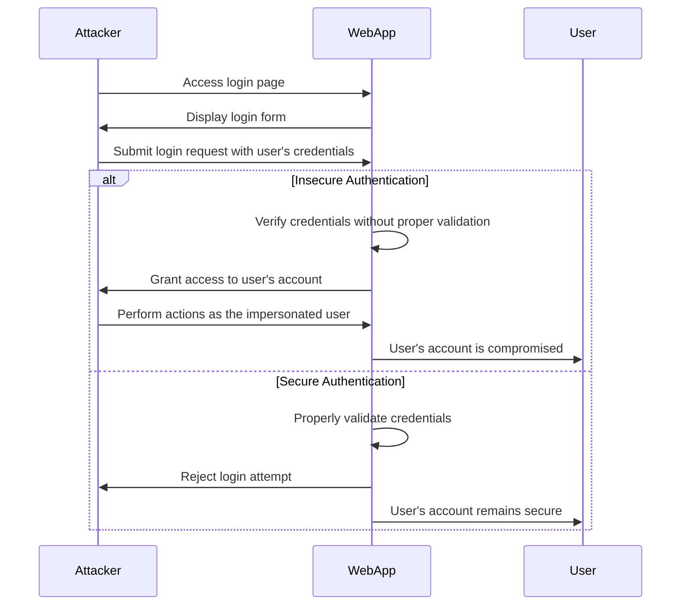

Here's a Mermaid diagram that illustrates how an attacker can impersonate a user via an insecure login process:

In this diagram:

1. The Attacker accesses the login page of the WebApp.
2. The WebApp displays the login form to the Attacker.
3. The Attacker submits a login request using the user's credentials, which may have been obtained through various means such as phishing, password guessing, or data breaches.

4. The diagram then shows two alternative scenarios:

   a. Insecure Authentication:
      - The WebApp verifies the submitted credentials without proper validation, such as not checking for password strength, not enforcing rate limiting, or not using secure authentication mechanisms.
      - The WebApp grants access to the user's account to the Attacker.
      - The Attacker can now perform actions as the impersonated user, potentially compromising the user's data and privileges.
      - The User's account is compromised as a result of the insecure authentication process.

   b. Secure Authentication:
      - The WebApp properly validates the submitted credentials, employing secure authentication mechanisms such as strong password policies, rate limiting, and multi-factor authentication.
      - The WebApp recognizes the login attempt as unauthorized and rejects it.
      - The User's account remains secure, and the Attacker is unable to impersonate the user.

To prevent user impersonation via insecure login, it's crucial to implement secure authentication practices, including:

- Enforcing strong password policies and validating password strength.
- Implementing rate limiting and account lockout mechanisms to prevent brute-force attacks.
- Using secure password hashing algorithms and storing hashed passwords instead of plain text.
- Implementing multi-factor authentication to add an extra layer of security beyond passwords.
- Validating and sanitizing user input to prevent injection attacks.
- Using secure communication channels (HTTPS) to protect credentials during transmission.

By adopting these security measures, the risk of user impersonation via insecure login can be significantly reduced, ensuring the integrity and confidentiality of user accounts.
