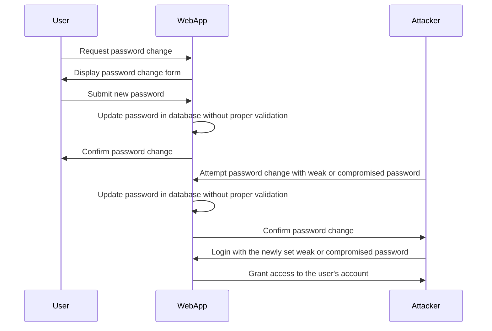

Here's a Mermaid diagram that illustrates an insecure password change process:

In this diagram:

1. The User requests a password change from the WebApp.
2. The WebApp displays the password change form to the User.
3. The User submits a new password through the form.
4. The WebApp updates the password in the database without proper validation or security measures.
5. The WebApp confirms the password change to the User.
6. An Attacker attempts a password change with a weak or compromised password.
7. The WebApp updates the password in the database without proper validation or security measures.
8. The WebApp confirms the password change to the Attacker.
9. The Attacker logs in to the WebApp using the newly set weak or compromised password.
10. The WebApp grants access to the user's account to the Attacker.

This diagram highlights several potential vulnerabilities in an insecure password change process:

- Lack of password strength validation: The WebApp allows users to set weak passwords that are easily guessable or susceptible to brute-force attacks.
- Absence of password confirmation: The WebApp does not require users to provide their current password or a confirmation of the new password, making it easier for attackers to change passwords without proper authorization.
- Insufficient password hashing: The WebApp may store passwords in plain text or use weak hashing algorithms, making them vulnerable to database breaches or password cracking attempts.

To mitigate these risks, it's important to implement secure password change mechanisms, :

- Enforcing strong password policies and validating password strength.
- Requiring users to provide their current password and a confirmation of the new password.
- Using secure password hashing algorithms and salting to store passwords in the database.
- Implementing rate limiting and account lockout mechanisms to prevent brute-force attacks.
- Providing additional security measures, such as two-factor authentication, to enhance account security.

By addressing these vulnerabilities, the password change process can be made more secure, reducing the risk of unauthorized access to user accounts.