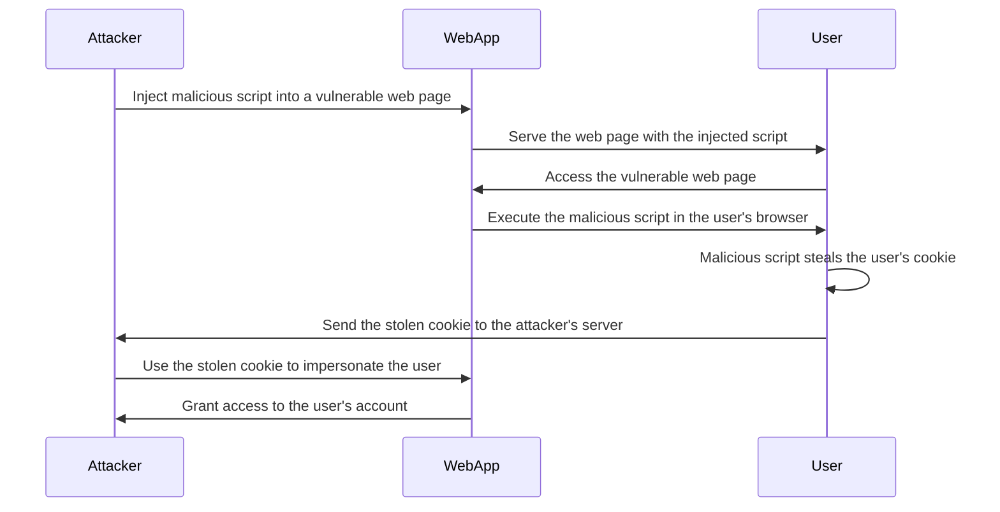

Here's a Mermaid diagram that illustrates an XSS (Cross-Site Scripting) attack via a cookie:

In this diagram:

1. The Attacker discovers a vulnerability in a web page of the WebApp that allows them to inject malicious JavaScript code.

2. The Attacker crafts a malicious script and injects it into the vulnerable web page. This script is designed to steal the user's cookie when executed in the user's browser.

3. The WebApp serves the web page containing the injected malicious script to the User.

4. The User accesses the vulnerable web page, unaware of the presence of the malicious script.

5. The User's browser executes the malicious script injected into the web page.

6. The malicious script, now running in the User's browser, steals the user's cookie. Cookies often contain sensitive information, such as session tokens or authentication credentials.

7. The stolen cookie is sent from the User's browser to the Attacker's server, typically through an HTTP request initiated by the malicious script.

8. The Attacker now possesses the User's stolen cookie and can use it to impersonate the User.

9. The Attacker sends a request to the WebApp, including the stolen cookie, effectively impersonating the User.

10. The WebApp, unaware that the request is coming from the Attacker, grants access to the User's account based on the valid cookie.

To prevent XSS attacks via cookies, it's important to implement proper security measures, including:

- Validating and sanitizing user input to prevent the injection of malicious scripts.
- Implementing proper output encoding to ensure that user-generated content is rendered as text and not executed as code.
- Setting the `HttpOnly` flag on sensitive cookies to prevent client-side access to cookie values.
- Implementing Content Security Policy (CSP) to restrict the execution of unauthorized scripts.
- Regularly updating and patching the WebApp to address known vulnerabilities that could be exploited for XSS attacks.
- Using secure cookie settings, such as setting the `Secure` flag to ensure cookies are only transmitted over HTTPS.

By implementing these security measures, the risk of XSS attacks via cookies can be significantly reduced, protecting users' sensitive information and preventing unauthorized access to their accounts.
