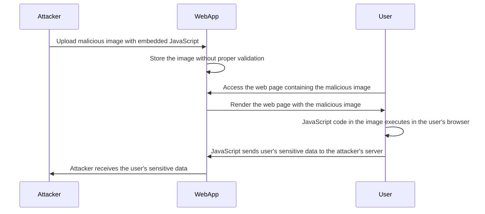

Here's a Mermaid diagram that illustrates an XSS (Cross-Site Scripting) attack via an image:

In this diagram:

1. The Attacker crafts a malicious image file that contains embedded JavaScript code. This code is designed to execute when the image is rendered in a user's browser.

2. The Attacker uploads the malicious image to the WebApp, typically through a feature that allows user-generated content, such as user profiles, comments, or image galleries.

3. The WebApp stores the uploaded image without proper validation or sanitization. It fails to check for any malicious code embedded within the image file.

4. A User accesses the web page on the WebApp that contains the malicious image. This could be a profile page, a comment section, or any other page where user-generated images are displayed.

5. The WebApp renders the web page and includes the malicious image in the page's content.

6. When the User's browser loads the web page, it encounters the malicious image and executes the embedded JavaScript code within the image file.

7. The malicious JavaScript code, now running in the User's browser, can perform unauthorized actions, such as:
   - Stealing the User's sensitive data (e.g., cookies, session tokens) and sending it to the Attacker's server.
   - Modifying the content of the web page or injecting additional malicious content.
   - Tricking the User into performing unintended actions or revealing sensitive information.

8. The Attacker receives the User's sensitive data sent by the malicious JavaScript code, allowing them to potentially compromise the User's account, steal personal information, or perform further attacks.

To prevent XSS attacks via images, it's important to implement proper security measures, including:

- Validating and sanitizing user-uploaded images to ensure they do not contain malicious code.
- Implementing content security policies (CSP) to restrict the execution of inline JavaScript code and limit the sources of executable scripts.
- Encoding user-generated content, including image file names and metadata, to prevent the injection of malicious code.
- Regularly updating and patching the WebApp to address known vulnerabilities that could be exploited for XSS attacks.
- Educating users about the risks of uploading untrusted images and encouraging them to be cautious when interacting with user-generated content.

By implementing these security measures, the risk of XSS attacks via images can be significantly reduced, protecting users from the unauthorized execution of malicious code in their browsers.
